# SmartApply — Complete System Architecture

**What this document is.** The full picture of the system: what each part does,
how the parts connect, the technology each is built on, and the rules that
govern them. It covers the central hub, the web portal, the AI services, the
four-hour discovery cycle, and the consultant desktop application.

Read **§1** and **§2** first — they give the shape of the whole thing in two
diagrams. Everything after that is detail on one part.

---

## Contents

| § | Section |
|---|---|
| 1 | [The system in one picture](#1-the-system-in-one-picture) |
| 2 | [Four independent stages](#2-four-independent-stages) |
| 3 | [The end-to-end journey](#3-the-end-to-end-journey) |
| 4 | [Who uses it](#4-who-uses-it) |
| 5 | [Setting up a consultant](#5-setting-up-a-consultant) |
| 6 | [Stage 1 — Discovery, every four hours](#6-stage-1--discovery-every-four-hours) |
| 7 | [Stage 2 — AI preparation](#7-stage-2--ai-preparation) |
| 8 | [The queue: two lanes](#8-the-queue-two-lanes) |
| 9 | [Stage 3 — Application](#9-stage-3--application) |
| 10 | [The desktop application](#10-the-desktop-application) |
| 11 | [Stage 4 — The permanent record](#11-stage-4--the-permanent-record) |
| 12 | [Operating limits](#12-operating-limits) |
| 13 | [Security model](#13-security-model) |
| 14 | [Data model](#14-data-model) |
| 15 | [Technology stack](#15-technology-stack) |

---

## 1. The system in one picture

A staffing firm represents consultants. Each consultant wants a particular kind
of job. The system finds those jobs across the whole market, works out who each
one suits, prepares a tailored application, and helps the consultant submit it
under their own name — keeping a permanent record of exactly what was sent.

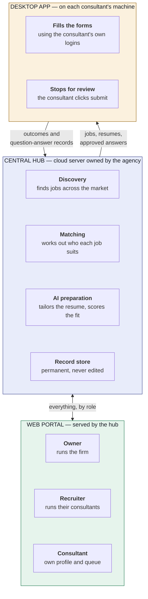

**Sensitive material flows one way.** The hub sends each consultant only the
jobs, resume files and approved answers needed for the work in front of them.
The desktop app sends back status and question-and-answer records. Consultant
machines keep no permanent data.

---

## 2. Four independent stages

This is the most important idea in the architecture. The system is **four
separate stages, each with its own trigger, its own failure behaviour, and its
own retry**. No stage can stall another.

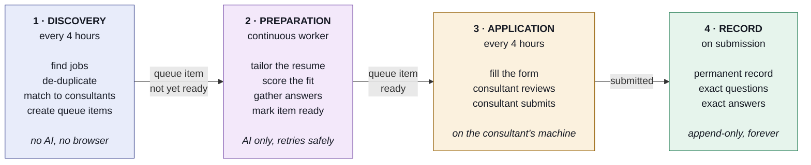

### Why the separation matters

| If this happens | What does **not** happen |
|---|---|
| The AI provider has an outage | Discovery keeps finding and matching jobs. Prepared items keep being applied to. |
| A search provider fails | Preparation and application carry on with everything already in the pool. |
| A consultant's laptop is off for a week | Discovery, matching and preparation continue. The work is waiting when they return. |
| Discovery takes longer than usual | Nothing else waits on it. The next cycle simply starts later. |

**The four-hour cycle never calls an AI model and never opens a browser.** It
fetches, de-duplicates, matches, and stops. Everything expensive or slow happens
in a stage that can fail and retry on its own.

---

## 3. The end-to-end journey

One consultant, from the day they join to a submitted application.

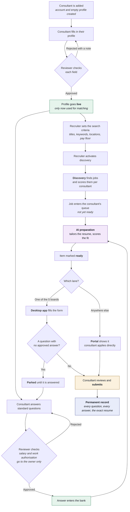

### The gates

Nothing about a consultant is used to represent them until a human has approved it.

| Gate | What it protects |
|---|---|
| **Profile approval** | No unverified personal detail reaches an employer |
| **Criteria activation** | No searching happens until a recruiter confirms the criteria |
| **Answer approval** | No form is filled with an unapproved answer. Salary and work authorisation go to the owner, never a recruiter |
| **Submit** | **The consultant clicks submit on every single application.** The machine never does |

---

## 4. Who uses it

Four roles, three separate portals.

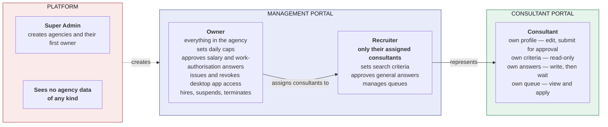

**Two rules enforced by absence rather than by a permission check:**

- **A consultant can never edit their own search criteria.** No screen, no route.
- **A job can never be moved to a different consultant.** No endpoint exists.
  Each person applies under their own name.

---

## 5. Setting up a consultant

Four things are configured once per consultant. Everything downstream reads them.

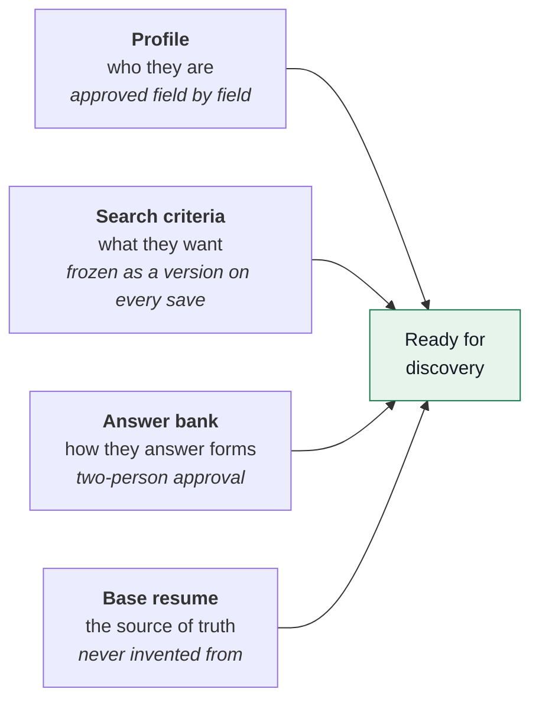

**Criteria are versioned and immutable.** Every save creates a new frozen
version; older ones stay readable, comparable and restorable. Each job that
reaches a consultant records the exact criteria version that matched it — so
"why was this job sent to this person?" is answerable years later against a
snapshot that still exists word for word.

---

## 6. Stage 1 — Discovery, every four hours

Runs on a schedule, or on demand. **It calls no AI model and opens no browser.**

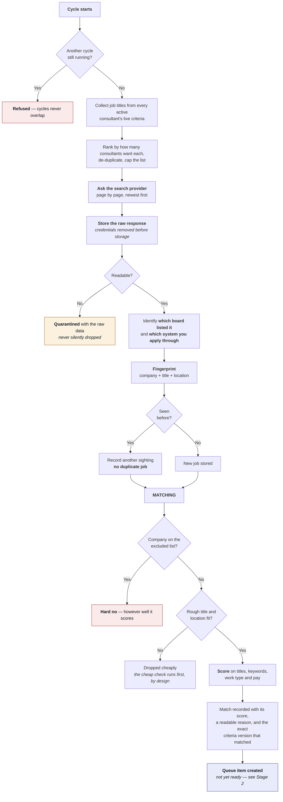

### Coverage: everything is ingested

The system takes **every job the provider returns** — the five named boards, the
large aggregators, applicant tracking systems, and employers' own careers pages.
A good role is a good role wherever it was listed.

Each job records two separate facts, because they are usually different:

| Recorded | Question it answers | Example |
|---|---|---|
| **Source** | Which board *listed* it | LinkedIn |
| **Portal** | Which system you *apply through* | Greenhouse |

That distinction decides which lane the job enters (§8) and is why per-board
yield stays measurable.

### The rules the cycle enforces

| Rule | In practice |
|---|---|
| **One row per real job** | The same job found twice becomes one job with two sightings — never a duplicate application |
| **Cheap check before expensive work** | An obvious non-match is dropped on a title comparison, not after full scoring |
| **Caps hold, never discard** | A strong job found on a busy day waits for tomorrow rather than being lost to the hour it arrived |
| **Overlap is visible, never blocked** | One job can suit three consultants; each applies under their own name and the overlap is flagged |
| **Nothing fails the whole cycle** | A failed search, an unreadable result, a disabled board — each is recorded and the cycle continues |

### Search providers

The provider is a swappable component. The system is built to run **one or
several** providers side by side; results from all of them pass through the same
de-duplication, so overlap between providers collapses automatically.

Because provider calls are metered, three limits bound spend: search terms per
cycle, result pages per term, and a hard ceiling on calls per cycle. Every cycle
records what it spent and what it declined to spend.

---

## 7. Stage 2 — AI preparation

A **continuous background worker**, entirely separate from the four-hour cycle.
It picks up queue items that are not yet ready, does the expensive work, and
marks them ready.

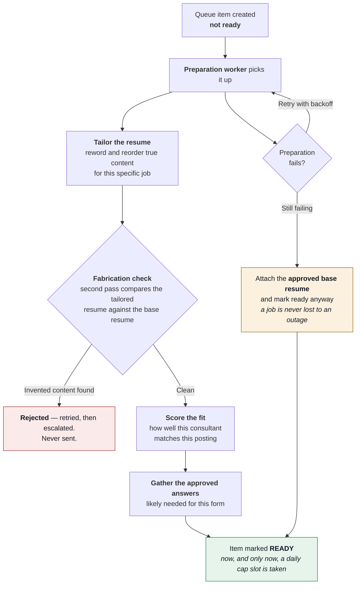

### The no-fabrication rule

**Tailoring may reword and reorder true content. It may never invent a skill, a
tool, an employer, a date, or an accomplishment.**

This is enforced twice: in the instruction set given to the model, and by a
**second pass that compares the tailored resume against the base resume** and
rejects anything that appears in one and not the other.

The instruction set lives in hub code only. **No portal user at any level — owner
included — can view, edit or weaken it.**

### Why preparation is a separate stage

- **A model outage costs nothing.** Discovery keeps working; prepared items keep
  being applied to; unprepared items retry.
- **Cost is bounded by the daily cap**, because preparation only runs for items
  that will actually be applied to.
- **A slot is taken when an item becomes ready, not when it is queued.** A
  failed preparation therefore never consumes a consultant's day.
- **Scoring improves selection over time.** Jobs held back by the cap are scored
  too, so the next cycle fills the queue best-first using what the AI learned —
  without the four-hour cycle ever calling a model.

---

## 8. The queue: two lanes

Every job that reaches a consultant enters one of two lanes, decided
automatically by **which system you apply through**.

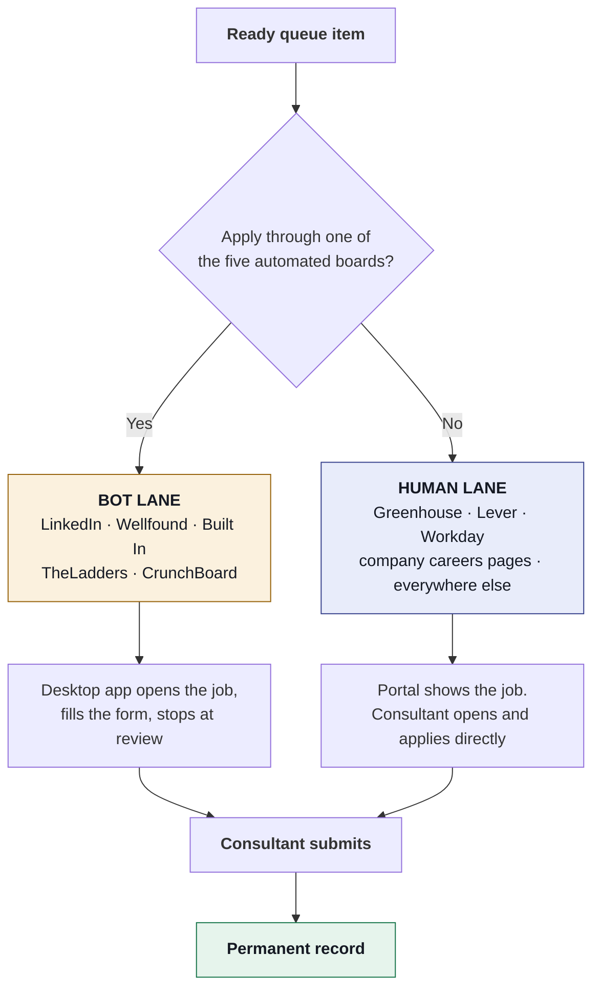

**Every job is worked either way.** The lane decides *who does the typing*, never
whether the job is pursued. Both lanes end in the same permanent record, and the
same daily cap governs both — an employer sees one person regardless of how the
form was filled.

### Queue item states

Movement between states is checked on every write. An illegal jump is refused by
the server, not merely hidden in the interface.

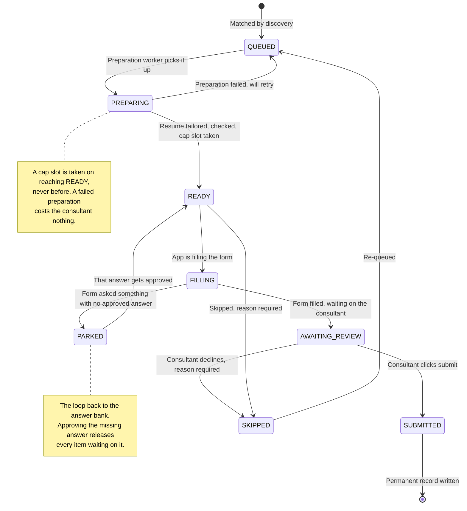

Every single move records who did it, when, from what state to what state, and
why. That history is the answer to *"what happened to this application?"*

---

## 9. Stage 3 — Application

### The bot lane

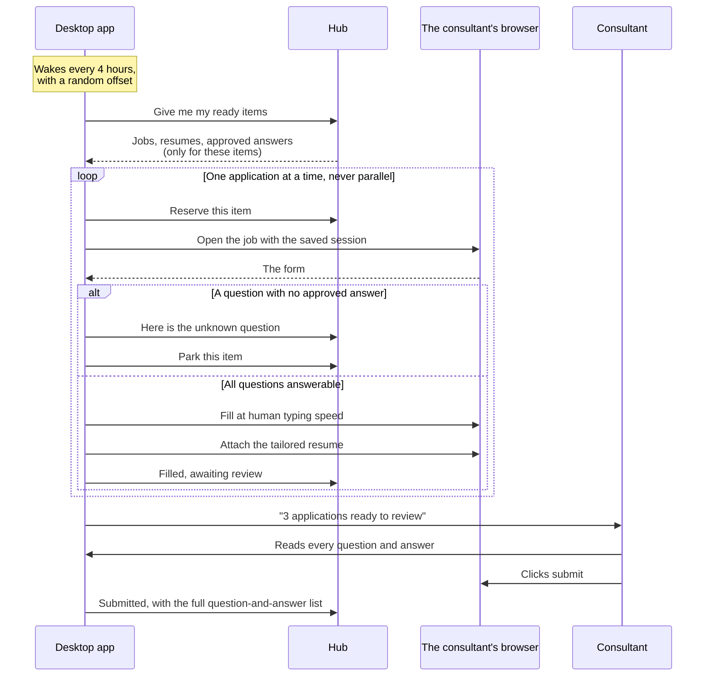

### The human lane

The portal shows the job with everything the consultant needs — the tailored
resume, the match reason, and their approved answers for reference. They open
the job and apply directly. The application is then recorded, either by the
desktop app if it witnessed it, or by the consultant marking it applied.

Records carry **how they were made**, so reporting stays honest about what it
actually knows:

| Recorded as | Meaning |
|---|---|
| `DESKTOP_BOT` | The app filled it; the consultant submitted; the app witnessed it |
| `DESKTOP_ASSISTED` | The consultant filled it in the app's browser; the app witnessed it |
| `PORTAL_SELF_REPORTED` | The consultant's own account of an application made elsewhere |

---

## 10. The desktop application

A small program on the consultant's own machine. **It is a filling assistant
with a human gate, not an auto-applier.**

### What the consultant sees

| Surface | Purpose |
|---|---|
| **Tray icon** | Always running, quietly. Idle / working / needs you / paused. |
| **Activation** | Once, ever. A one-time code issued by the owner. |
| **Sign-in prompts** | The first time a board is needed, a normal browser window opens and the app steps aside. |
| **Ready to review** | The main screen. Each filled application with its job, attached resume, and every question and answer. A submit button per row. |
| **Needs you** | Jobs paused on an unanswered question, and jobs whose form lives on a site the app does not fill. |
| **Notifications** | Two only: *"3 applications ready to review"* and *"Your session expired — please sign in again."* |

### How sign-in works

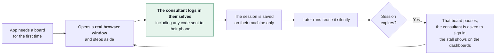

**The app has no password field and no code path that reads one.** It never
holds, stores or transmits a portal password.

### Built-in behaviour limits

- **One application at a time.** Never parallel, across all boards.
- **Human-paced typing** with realistic delays and pauses between fields.
- **The daily cap is enforced on the machine as well as at the hub.**
- **A random offset on each wake**, so activity is never machine-timed.
- **LinkedIn receives the most conservative treatment:** lowest volume, and the
  app stops touching LinkedIn for the rest of the day on any bot-check.
- **A filling failure parks the application with a clear error.** It never
  submits partial or wrong data.

### What stays on the machine

**Permanently:** the device token and the saved browser sessions. Nothing else.

**For one cycle:** the resume for each job, deleted at the end of the cycle and
again on startup, so a crash cannot leave one behind.

**Reports survive interruption.** Every outcome is written to local storage
before it is sent, and retried until the hub confirms it — so an application
submitted just as the network drops still reaches the permanent record.

---

## 11. Stage 4 — The permanent record

For every application, kept indefinitely:

- **The record** — consultant, job, company, portal, date and time, how it was
  submitted, and its final status.
- **The exact resume file** that was submitted, linked to the record.
- **Every question the form asked and the exact answer given**, in order, stored
  as the form worded it.
- **A full audit trail** — every login, resume delivery, answer approval,
  assignment change, and device token issued or revoked, with who, what, when
  and from which machine.

**These records are append-only, enforced at the database itself.** The account
the application runs as has had its permission to modify or delete them revoked.
Nobody edits an application record — not a recruiter, not an owner, not through
direct database access.

Questions are stored **as the form worded them**, not as a link to the question
bank. The bank is editable; an application record is a statement about what a
specific employer asked on a specific day, and must stay true even after the
canonical wording changes.

---

## 12. Operating limits

Three independent budgets, each visible and each enforced.

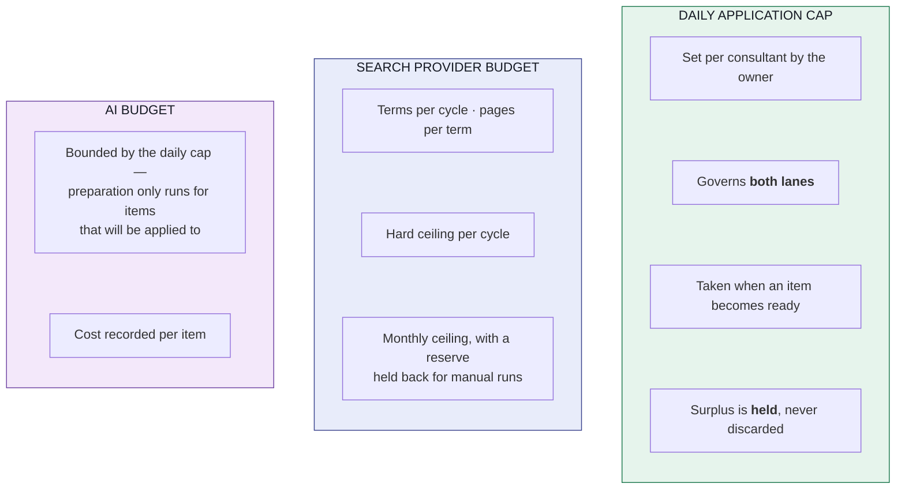

**The daily cap is a quality and safety limit, not a throughput limit.** It
protects the consultant's own reputation with employers, keeps the human review
manageable, keeps the pacing credible, and bounds AI cost. It resets on the
agency's own timezone.

---

## 13. Security model

Three independent layers. The third is convenience; the first two are the real
protection.

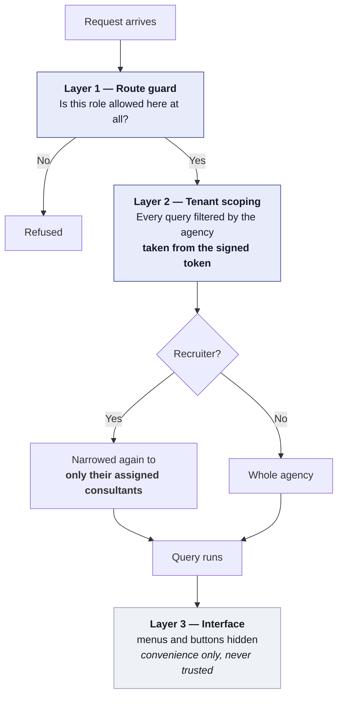

**The agency is read from the signed login token** — never from the URL, the body
or a query parameter. A user cannot request another agency's data by editing a
request, because the part that decides which agency they belong to is not theirs
to edit.

### Desktop app access

- **One device token per consultant per machine**, issued by the owner and bound
  to both the person and that machine.
- **Only the owner grants access.** A token cannot be reused on a second machine.
- **Revocation is immediate.** On the next call the app wipes its local data,
  clears its token, and returns to the activation screen.

### Further controls

- Resumes are delivered **per job only**. There is no bulk resume download
  anywhere in the system, for any role.
- Every resume delivery is logged with time, person and machine.
- **Two-person rule on every reusable answer:** one person fills it, a different
  person approves it. A consultant can never approve their own.
- All data encrypted at rest; all traffic between app, portal and hub encrypted
  in transit.
- Daily encrypted backups kept off the server, with a monthly restore test.
- **No real candidate data enters the system until the security review is
  complete.** All build and test work uses seeded fictional data.

---

## 14. Data model

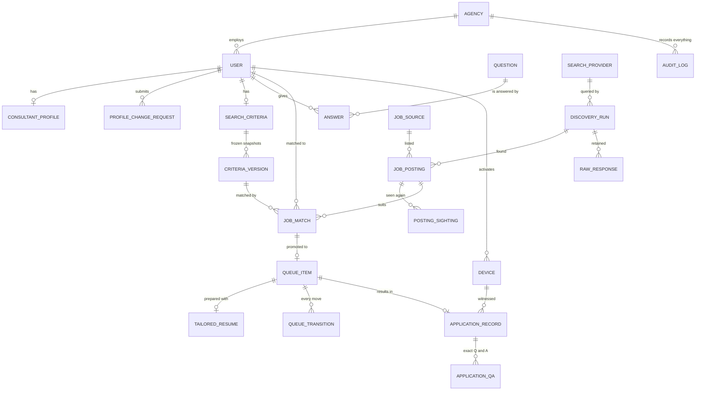

Four deliberate choices worth calling out:

1. **A match and a queue slot are different things.** A job can suit a consultant
   without there being room for it today. Keeping them separate is what makes
   "held, not discarded" possible.
2. **Criteria versions are frozen, and each match points at one.** That is how
   "why did this person get this job?" stays answerable years later.
3. **Raw provider responses are retained.** If the way results are read turns out
   to be wrong, the fix can be replayed over stored history instead of losing
   everything that arrived meanwhile.
4. **Source and portal are separate columns.** One says which board listed the
   job; the other says which system you apply through. They are usually
   different, and conflating them would make both the lane routing and the
   per-board reporting wrong.

---

## 15. Technology stack

| Part | Technology | Why |
|---|---|---|
| **Hub service** | Node.js · Express | One language across hub, portal and desktop app. |
| **Database** | PostgreSQL | Handles the record store and audit log for years without attention. Append-only enforcement at the database level. |
| **Scheduler** | Node cron in the hub process | The four-hour cycle and the preparation worker. |
| **Web portal** | React · Vite · Tailwind | Served by the hub. Shares its design system and API client with the desktop app. |
| **Resume storage** | Object storage, encrypted | Keeps large files out of the database. |
| **Job discovery** | Search provider API | Swappable; the system supports one or several running side by side. |
| **AI** | Large language model API | Resume tailoring and fit scoring, with the no-fabrication check as a second pass. |
| **Desktop app** | Electron · Playwright · SQLite | Electron for the tray, installer and review screen. Playwright drives the consultant's own installed browser, which is what makes saved logins work. SQLite for the local queue cache and the report outbox. |
| **App packaging** | electron-builder | Signed installer with automatic updates. Windows first; the codebase is cross-platform. |
| **Transport** | HTTPS/TLS throughout | Between app, portal, hub and every external service. |

### Why one language across all three parts

The hub, the portal and the desktop app are all JavaScript. The API client,
validation rules, shared types and design system are written once and used
everywhere. A change to an endpoint contract is a change in one place, and one
developer can move between all three parts without switching toolchains.

### Where the heavy work happens

The hub stays deliberately light — it fetches, matches, prepares and records.
**The browser work happens on consultant machines**, using their own logins and
their own sessions, which is both what makes the applications genuinely theirs
and what keeps the server small.
