# SmartApply — Complete System Workflow

**What this document is.** A single, plain-language map of the whole system:
what each part does, who touches it, how the pieces connect, and what is built
versus still to come. Every diagram below renders in GitHub, GitLab and most
Markdown viewers.

**Read §1 and §2 first.** They give you the shape of the whole thing in two
diagrams. Everything after that is detail on one part.

---

## Table of contents

| § | Section |
|---|---|
| 1 | [What the system does, in one picture](#1-what-the-system-does-in-one-picture) |
| 2 | [The end-to-end journey](#2-the-end-to-end-journey) |
| 3 | [Who uses it](#3-who-uses-it) |
| 4 | [Phase 1 — Accounts, roles and tenant isolation](#4-phase-1--accounts-roles-and-tenant-isolation) |
| 5 | [Phase 2 — Consultant profiles and approvals](#5-phase-2--consultant-profiles-and-approvals) |
| 6 | [Phase 3 — Search criteria](#6-phase-3--search-criteria) |
| 7 | [Phase 4 — The answer bank](#7-phase-4--the-answer-bank) |
| 8 | [Phase 5 — Job discovery, matching and the queue](#8-phase-5--job-discovery-matching-and-the-queue) |
| 9 | [The queue state machine](#9-the-queue-state-machine) |
| 10 | [What comes next](#10-what-comes-next) |
| 11 | [The security model](#11-the-security-model) |
| 12 | [The data model](#12-the-data-model) |
| 13 | [Build status](#13-build-status) |

---

## 1. What the system does, in one picture

A staffing firm represents consultants. Each consultant wants a particular kind
of job. The system finds those jobs, works out who each one suits, and queues
them for application under that consultant's own name — keeping a permanent
record of exactly what was sent, to whom, and why.

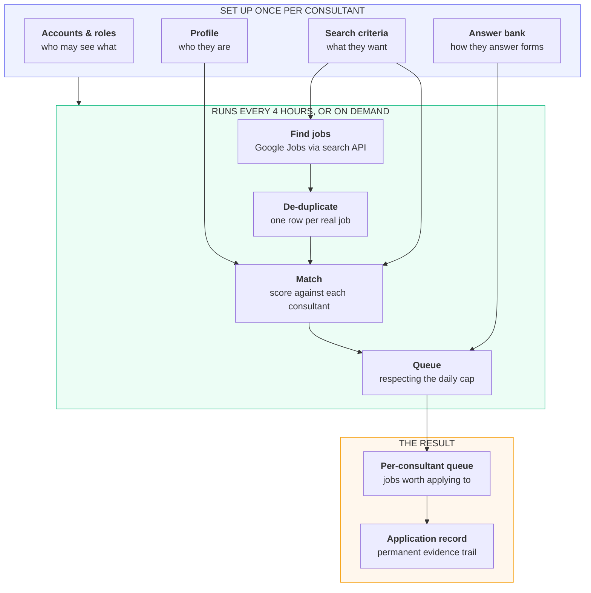

**The one-sentence version:** four things are set up per consultant, an engine
runs on a schedule, and the output is a queue of relevant jobs plus a permanent
record of every application made.

---

## 2. The end-to-end journey

One consultant, from the day they are added to the day an application is
recorded. Colour tells you what exists today.

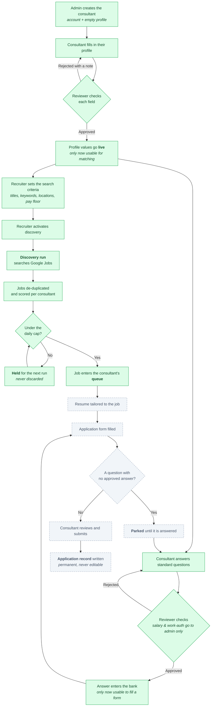

> **Green** = built and working today.
> **Grey dashed** = designed, not yet built. See [§10](#10-what-comes-next).

The three approval gates are the spine of the product. Nothing about a
consultant is used to represent them until a human has approved it:

| Gate | What it protects |
|---|---|
| Profile approval | No unverified personal detail reaches an employer |
| Criteria activation | No job search runs until a recruiter says the criteria are right |
| Answer approval | No form is filled with an unapproved answer — salary and work authorisation go to an admin, never a recruiter |

---

## 3. Who uses it

Four roles, three separate portals.

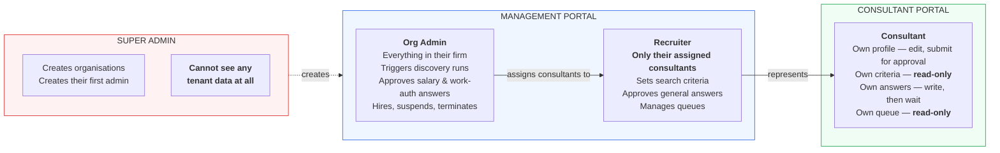

**Two rules that are enforced by absence, not by a permission check:**

- **A consultant can never edit their own search criteria.** There is no such
  screen and no such API route.
- **A queued job can never be moved to a different consultant.** No endpoint
  exists to do it. Each person applies under their own name.

---

## 4. Phase 1 — Accounts, roles and tenant isolation

Two staffing firms use the same installation and must never see each other's
data. This is the foundation everything else sits on.

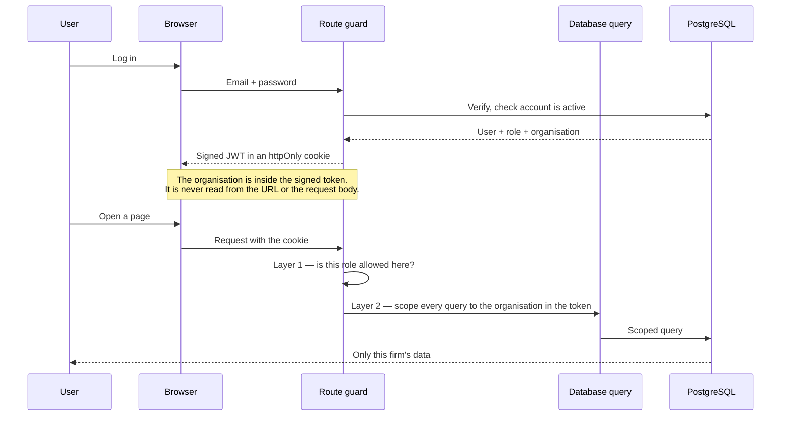

Every account action is written to an append-only audit log: who did it, when,
from what IP, and what changed. The application's own database user has no
permission to modify or delete those rows.

---

## 5. Phase 2 — Consultant profiles and approvals

The consultant maintains their own details, but nothing they type goes live
until a reviewer approves it — field by field.

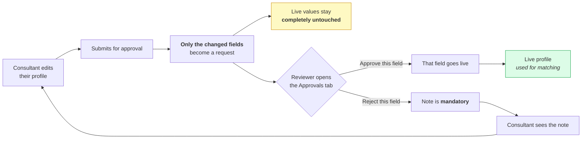

**Why field-by-field?** A consultant who updates five things and gets one wrong
should not have the other four blocked. Each field is judged on its own.

**The employment lifecycle** runs alongside it, and it is deliberately
asymmetric:

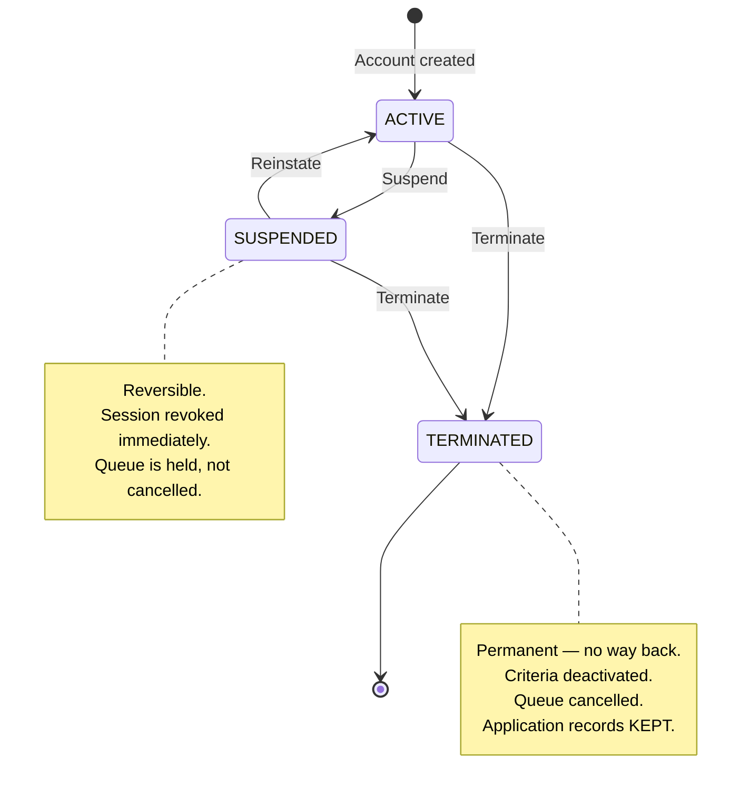

Suspending is reversible; terminating is not. In both cases the person's live
session is killed on the next request — a disabled account cannot keep working
because it already had a valid token.

---

## 6. Phase 3 — Search criteria

What kind of job this consultant wants. Owned by the recruiter, visible to the
consultant, editable by neither without a trace.

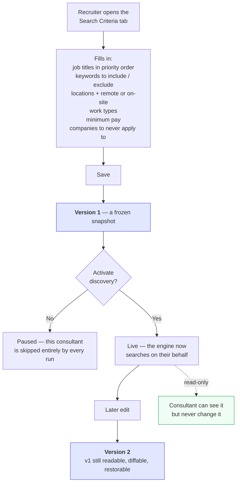

**Why freeze every version?** Because six months from now, someone will ask
"why was this job sent to this person?" Each queued job stores the exact
criteria version that matched it — a snapshot that still exists word for word,
not whatever the criteria happen to say today.

---

## 7. Phase 4 — The answer bank

Application forms ask the same questions over and over. The consultant answers
them once; a reviewer approves; the approved answer is then available to fill
any form.

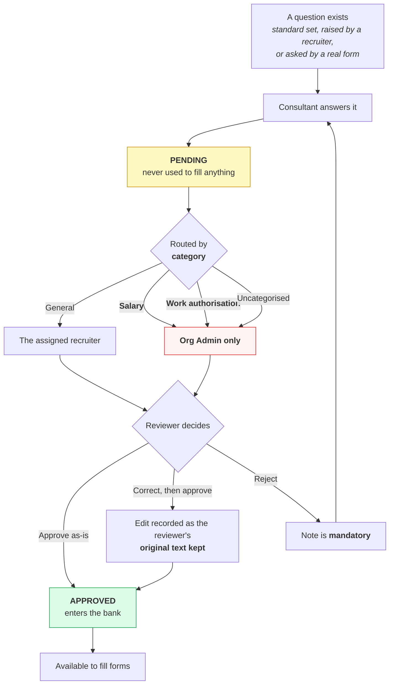

**Why do salary and work-authorisation answers skip the recruiter?** They are
the two answers with legal and commercial consequences. A recruiter who could
quietly adjust a stated salary expectation or a visa status is a risk the
design removes rather than monitors. Anything uncategorised also goes to the
admin — the safe default.

---

## 8. Phase 5 — Job discovery, matching and the queue

This is the engine. It was rebuilt: the original design crawled five job boards
directly, and four of them block automated access outright. It now reads
**Google's index of those same boards** through a paid search API.

### 8.1 Why the change

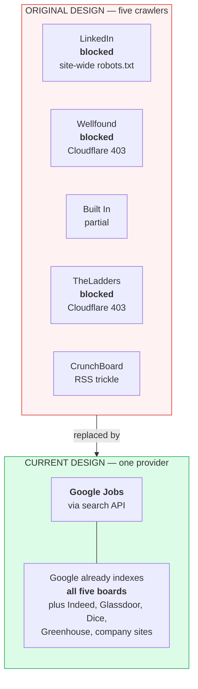

| | Old | New |
|---|---|---|
| Boards actually reachable | 2 of 5, partially | All 5, plus many more |
| Legal position | Against every board's terms | A paying customer of a documented API |
| Parsers to maintain | 5 HTML parsers + sitemap + RSS + robots engine | 1 JSON contract |
| Risk | Account bans, arms race with bot detection | A metered bill |
| Code | ~1,200 lines | ~400 lines |

**Everything the API returns is kept.** The five named boards are the
*priority set* — the coverage we guarantee — not a filter. A strong role from
Indeed or an employer's own careers page is a real lead and goes into the same
queue.

### 8.2 The discovery pipeline

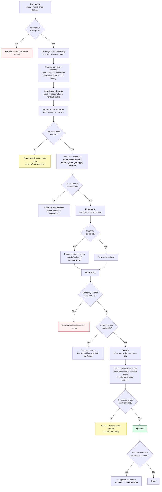

### 8.3 The five design rules the pipeline enforces

| Rule | What it means in practice |
|---|---|
| **One row per real job** | The same job found twice becomes one posting with two sightings — never two queue items, never a duplicate application |
| **Cheap filter before expensive work** | An obvious non-match is dropped on a title comparison, not after a full scoring pass |
| **Caps hold, they do not discard** | A great job found on a busy day waits for tomorrow instead of being lost to the hour it arrived |
| **Overlap is visible, not prevented** | One job can legitimately suit three consultants; each applies under their own name and a recruiter can see the overlap |
| **Nothing fails the whole run** | A broken search, an unreadable result, a board that is switched off — each is recorded and the cycle carries on |

### 8.4 Cost control

The search API is metered: **every page of results is one credit.**

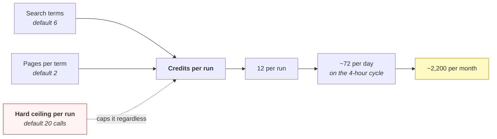

Three protections: a cap on search terms, a cap on pages per term, and a hard
per-run call ceiling that applies no matter what the first two are set to. Each
run records what it spent, so cost is visible on the screen rather than
discovered on an invoice.

---

## 9. The queue state machine

Once a job is queued, it moves through a fixed set of states. Illegal jumps are
refused by the server, not merely hidden in the interface.

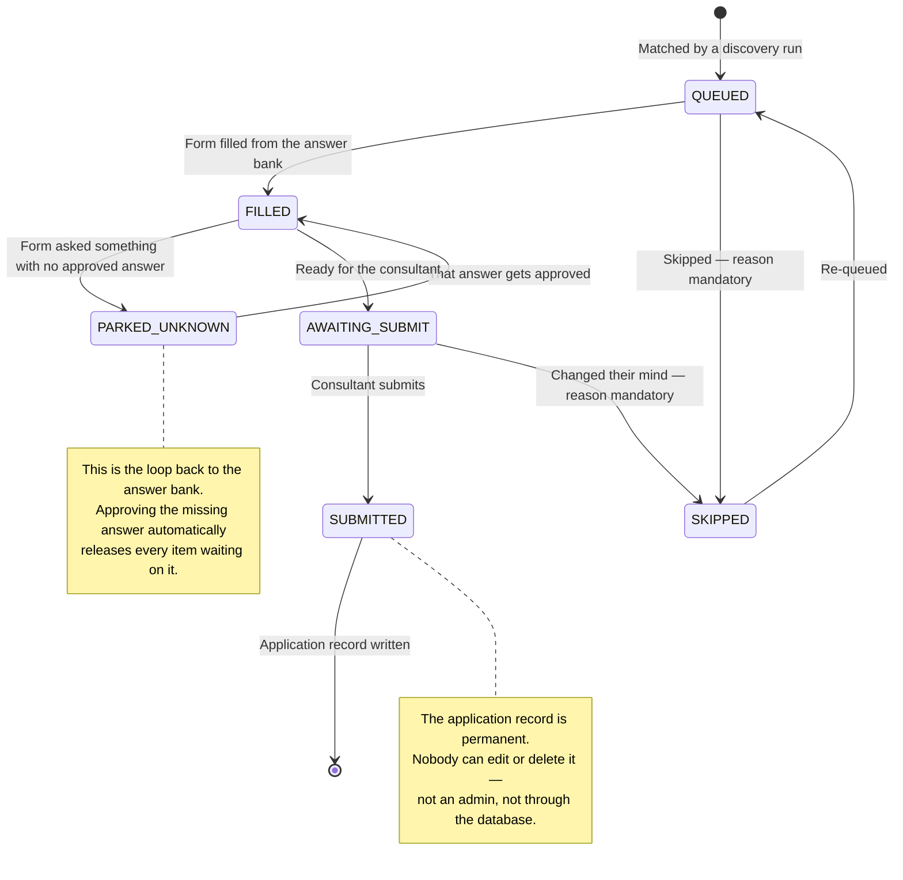

Every single move writes a row: who moved it, when, from what state to what
state, and why. That history is the answer to "what happened to this
application?"

---

## 10. What comes next

```mermaid
flowchart LR
    subgraph DONE["BUILT"]
        direction TB
        A["Accounts &amp; roles"]
        B["Profiles &amp; approvals"]
        C["Search criteria"]
        D["Answer bank"]
        E["Discovery, matching &amp; queue"]
    end

    subgraph NEXT["NEXT"]
        direction TB
        F["<b>Resume tailoring</b><br/>a version of the CV per job"]
        G["<b>Contacts</b><br/>recruiter contacts per posting<br/>plus a do-not-contact list"]
    end

    subgraph LATER["LATER"]
        direction TB
        H["<b>Consultant desktop app</b><br/>fills and submits the actual forms"]
        I["<b>Application records</b><br/>every question and answer, as sent"]
        J["Two-step verification<br/>Forgot-password email"]
    end

    DONE --> NEXT --> LATER

    style DONE fill:#dcfce7,stroke:#16a34a
    style NEXT fill:#fef9c3,stroke:#ca8a04
    style LATER fill:#f1f5f9,stroke:#94a3b8
```

### The one honest gap

Nothing yet fills or submits a form. That is the desktop app, and it is a
separate piece of work. Until it exists:

- Queue items reach **QUEUED** and stop there.
- The states beyond it are defined and enforced, but nothing drives an item
  through them.
- Application records can be entered by hand — which is what staffing firms do
  anyway when someone applies manually — and become automatic once a submitter
  exists.

This is deliberate and was flagged from the start. The queue is genuinely
useful on its own: it tells a recruiter exactly which jobs are worth this
person's time today, and why.

> **A note on numbering.** The two planning documents number the remaining
> phases differently — one has Contacts as Phase 6, the other has Resume
> Tailoring there. The scope is the same either way; only the labels differ.

---

## 11. The security model

Three independent layers. The third is convenience; the first two are the real
protection.

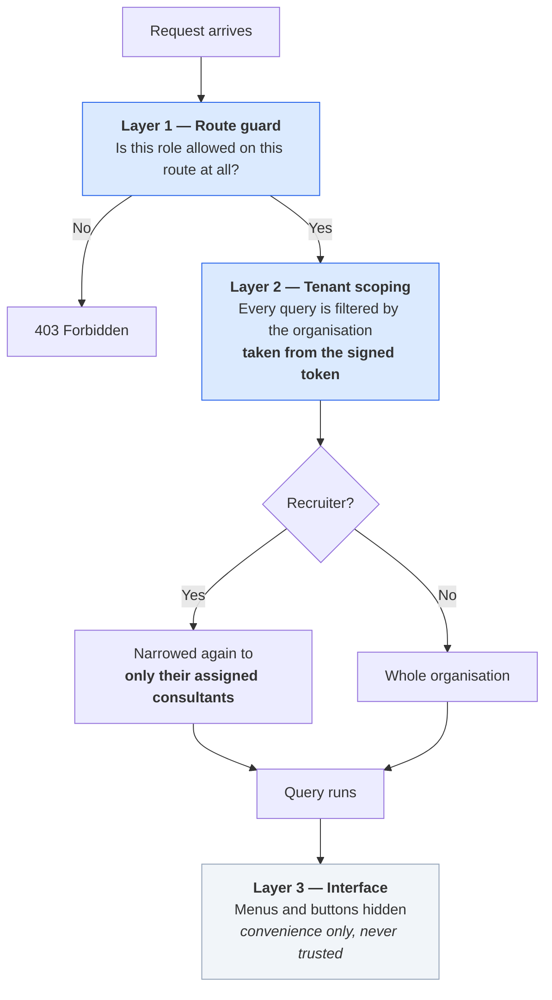

**The detail that matters:** the organisation is read from the signed login
token — never from the URL, the request body, or a query parameter. A user
cannot ask for another firm's data by editing a request, because the part of
the request that decides which firm they belong to is not theirs to edit.

**Append-only records.** Audit logs and application records are protected at
the database level, not just in code: the account the application connects as
has had its permission to update or delete those rows revoked. Even a
successful SQL injection could not rewrite that history.

---

## 12. The data model

The main tables and how they relate.

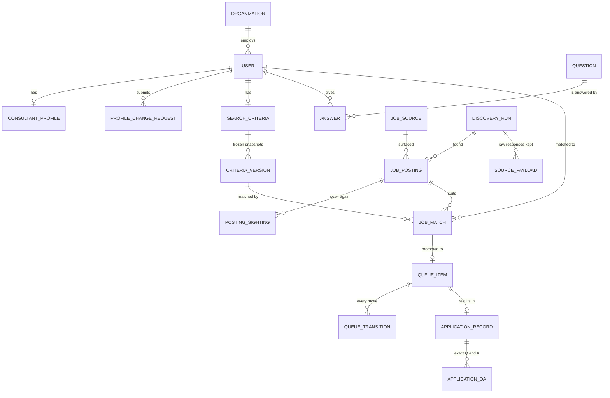

Three deliberate choices worth calling out to anyone reviewing this:

1. **A match and a queue slot are different things.** A job can suit a
   consultant without there being room for it today. Keeping them separate is
   what makes "held, not discarded" possible.
2. **Criteria versions are frozen, and each match points at one.** That is how
   "why did this person get this job?" stays answerable years later.
3. **Raw API responses are retained.** If the way we read results turns out to
   be wrong next month, the fix can be replayed over the stored history instead
   of losing everything that arrived while it was broken.

---

## 13. Build status

| Phase | Scope | Status |
|---|---|---|
| **1** | Multi-tenant accounts, 4 roles, 3 portals, audit log | ✅ Complete |
| **2** | Consultant profiles, field-by-field approval, resume upload | ✅ Complete |
| **2.1** | Employment lifecycle, session revocation, lockout | ✅ Complete |
| **3** | Search criteria, immutable versioning, pause/activate | ✅ Complete |
| **4** | Answer bank, category routing, approvals | ✅ Complete *(one admin screen deferred)* |
| **5** | Job discovery via search API, de-duplication, matching, daily caps, queue | ✅ Built — **needs an API key to go live** |
| **6** | Resume tailoring per job | ⬜ Planned |
| **7** | Contacts and do-not-contact list | ⬜ Planned |
| **later** | Consultant desktop app, automatic application records, two-step verification, password reset by email | ⬜ Planned |

### What is needed to switch Phase 5 on

1. A **search API account** and its key, added to the server configuration.
2. A decision on the **plan tier**, which sets the credit budget — that in turn
   sets how often the cycle runs and how deep each search goes.
3. Turning the provider **on** from the discovery screen. It ships switched off
   deliberately, so the first request and the first credit spent are somebody's
   decision rather than a side effect of installing the software.

Until then, discovery runs still complete: they fetch nothing, say so plainly,
and match against whatever is already in the pool.
